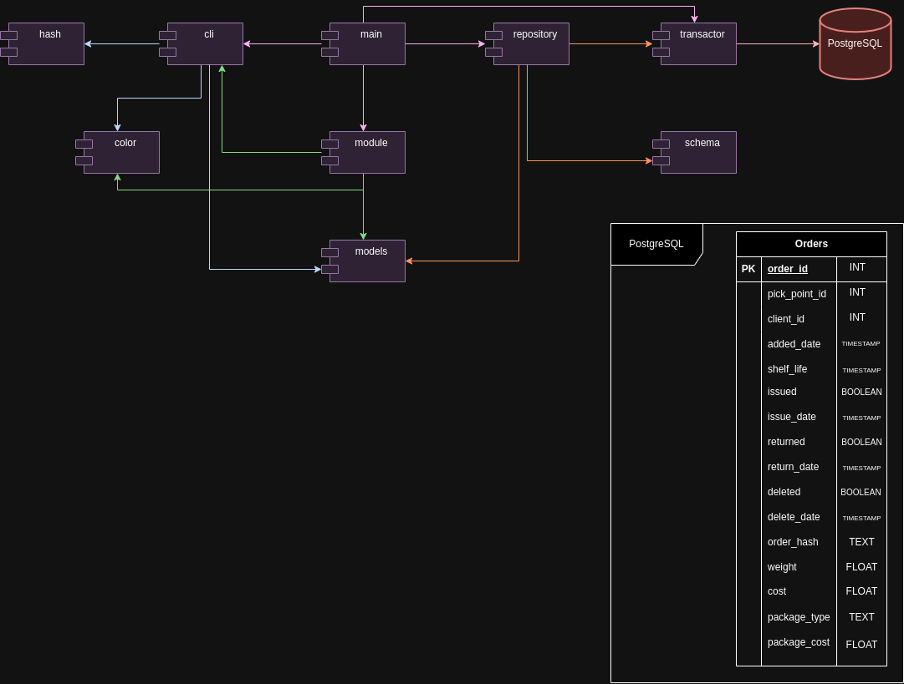

# Архитектура проекта по управлению пунктом выдачи заказов

## Основные компоненты

1. **Main**:
   - Инициализация контекста.
   - Настройка соединения с базой данных с использованием `pgxpool`.
   - Инициализация транзакционного менеджера и репозитория.
   - Создание и запуск модуля управления пунктом выдачи.
   - Создание и запуск CLI.
   - Запуск рабочих горутин для обработки задач.

2. **CLI** (`cli` package):
   - Принимает команды пользователя и добавляет задачи в очередь задач.
   - Обрабатывает задачи с использованием бизнес-логики модуля.

3. **Module** (`module` package):
   - Взаимодействует с репозиторием для выполнения операций над заказами.
   - Управляет транзакциями через транзакционный менеджер.

4. **Repository** (`repository` package):
   - Выполняет SQL-запросы для операций с таблицами базы данных.
   - Конвертирует структуры `schema` в доменные модели `models`.

5. **Models** (`models` package):
   - Определяет доменные модели, такие как `Order`, `ClientId`, `PickPointId`, и т.д.
   - Определяет интерфейс для упаковки и различные типы упаковок (`Bag`, `Box`, `Film`).

6. **Transactor** (`transactor` package):
   - Управляет транзакциями, обеспечивает выполнение операций в рамках транзакций с повторяемым чтением.

## Диаграмма архитектуры

Для лучшего понимания архитектуры проекта, ниже приведена диаграмма, отображающая основные компоненты и их взаимодействие.



## Стандарт UML

Для описания архитектуры и компонент системы был выбран стандарт **Unified Modeling Language (UML)**. UML предоставляет набор графических нотаций, которые помогают визуализировать, специфицировать, конструировать и документировать компоненты и взаимодействия системы. 

UML включает различные типы диаграмм, такие как диаграммы классов, диаграммы последовательностей, диаграммы состояний и другие. В данном проекте мы использовали диаграммы классов для описания структур данных и диаграммы последовательностей для иллюстрации потоков выполнения.

### Документация UML

Официальная документация и спецификация UML доступна по следующей ссылке: [OMG UML Specification](https://www.omg.org/spec/UML/).

## Основные процессы

1. **Инициализация**:
   - Основная функция `main` инициализирует контекст, соединение с базой данных и транзакционный менеджер.
   - Создаются репозиторий и модули.
   - Запускается CLI для приема команд от пользователя.

2. **Обработка команд**:
   - Пользователь вводит команды через CLI.
   - CLI разбирает команды и параметры, создает задачи и добавляет их в очередь задач.
   - Воркеры обрабатывают задачи, вызывая соответствующие функции модуля.

3. **Работа с базой данных**:
   - Репозиторий выполняет SQL-запросы для взаимодействия с базой данных.
   - Транзакционный менеджер обеспечивает целостность данных с использованием транзакций.
   - Данные преобразуются между структурой базы данных и доменными моделями.

## Пример команды и её обработки

1. **Прием заказа от курьера**:
   - Пользователь вводит команду: `acceptCurier --orderId=301 --clientId=123 --shelfLife=2024-08-20T22:42:00+03:00 --weight=12.3 --cost=12.3 --packageType=box`.
   - CLI разбирает параметры команды и создает задачу.
   - Задача добавляется в очередь задач и обрабатывается воркером.
   - Воркер вызывает метод `AcceptOrderFromCurier` модуля.
   - Модуль проверяет наличие заказа, создает новый заказ и сохраняет его в базе данных через репозиторий.

## Структура базы данных

```sql
CREATE TABLE IF NOT EXISTS orders (
    order_id INT PRIMARY KEY,
    pick_point_id INT NOT NULL,
    client_id INT NOT NULL,
    added_date TIMESTAMP NOT NULL,
    shelf_life TIMESTAMP NOT NULL,
    issued BOOLEAN NOT NULL DEFAULT FALSE,
    issue_date TIMESTAMP DEFAULT '0001-01-01 00:00:00',
    returned BOOLEAN NOT NULL DEFAULT FALSE,
    return_date TIMESTAMP DEFAULT '0001-01-01 00:00:00',
    deleted BOOLEAN NOT NULL DEFAULT FALSE,
    delete_date TIMESTAMP DEFAULT '0001-01-01 00:00:00',
    order_hash TEXT UNIQUE NOT NULL,
    weight FLOAT NOT NULL,
    cost FLOAT NOT NULL,
    package_type TEXT NOT NULL DEFAULT 'film',
    package_cost FLOAT NOT NULL DEFAULT 1.0
);
```

## Шаблон проектирования

В данном проекте для управления типами упаковок используется **фабричный метод (Factory Method)**. Этот шаблон проектирования позволяет создавать объекты без необходимости указывать точный класс создаваемого объекта. В нашем случае, фабричный метод используется для создания различных типов упаковок (`Bag`, `Box`, `Film`).

### Интерфейс `Package`

Интерфейс `Package` определяет набор методов, которые должны быть реализованы всеми типами упаковок:

```go
type Package interface {
    Type() string
    Cost() float64
    Validate(order Order) error
}
```

### Фабрика упаковок

Функция `PackageFactory` создает объекты конкретных типов упаковок на основе переданного имени:

```go
func PackageFactory(name string) (Package, error) {
    switch name {
    case "bag":
        return Bag{}, nil
    case "box":
        return Box{}, nil
    case "film":
        return Film{}, nil
    default:
        return nil, errors.New("неизвестный тип упаковки")
    }
}
```

### Реализация упаковок

- **Bag**

```go
package models

import "errors"

type Bag struct{}

func (b Bag) Type() string {
    return "bag"
}

func (b Bag) Cost() float64 {
    return 5
}

func (b Bag) Validate(order Order) error {
    if order.Weight >= 10 {
        return errors.New("вес заказа больше или равен 10 кг, пакет не подходит")
    }
    return nil
}
```

- **Box**

```go
package models

import "errors"

type Box struct{}

func (b Box) Type() string {
    return "box"
}

func (b Box) Cost() float64 {
    return 20
}

func (b Box) Validate(order Order) error {
    if order.Weight >= 30 {
        return errors.New("вес заказа больше или равен 30 кг, коробка не подходит")
    }
    return nil
}
```

- **Film**

```go
package models

type Film struct{}

func (f Film) Type() string {
    return "film"
}

func (f Film) Cost() float64 {
    return 1
}

func (f Film) Validate(order Order) error {
    return nil
}
```

Использование фабричного метода и интерфейсов позволяет легко расширять систему новыми типами упаковок, не изменяя существующий код, что улучшает поддержку и масштабируемость проекта.

## Документация по кешированию

### Введение

Для уменьшения нагрузки на базу данных и улучшения производительности приложения, было решено внедрить механизм кеширования с использованием Redis. Это позволяет снизить количество запросов к базе данных, сохраняя часто запрашиваемые данные в памяти.

### Выбор инструмента кеширования (Redis)

Redis был выбран в качестве инструмента кеширования по следующим причинам:

- **Высокая производительность**. Redis работает исключительно в памяти, что обеспечивает очень высокую скорость чтения и записи данных.
- **Простота использования**. Redis предоставляет простые и интуитивно понятные интерфейсы для работы с данными.
- **Гибкость**. Redis поддерживает различные структуры данных, такие как строки, хэши, списки, множества и т.д., что делает его универсальным инструментом для кеширования.
- **Масштабируемость**. Redis легко масштабируется горизонтально, что позволяет эффективно обрабатывать большое количество запросов.

### Механизм инвалидации кеша

Для обеспечения актуальности данных в кеше был выбран следующий механизм инвалидации:

- **Time-to-Live (TTL)**. Каждый элемент в кеше имеет время жизни, по истечении которого он автоматически удаляется из кеша. В данном проекте время жизни устанавливается при создании клиента Redis и задается в файле `config.yml`.
- **Политика вытеснения LRU (Least Recently Used)**. Если объем памяти, выделенной для Redis, превышается, Redis автоматически удаляет наименее недавно используемые элементы. Это позволяет избежать переполнения памяти и сохранить в кеше только наиболее часто используемые данные.

### Ограничение потребления ресурсов кеша

Для ограничения потребления ресурсов кеша был выбран механизм LRU (Least Recently Used), который вытесняет наименее недавно используемые элементы при превышении заданного объема памяти. Этот механизм был выбран по следующим причинам:

- **Простота реализации**. LRU легко реализуется и поддерживается большинством библиотек Redis.
- **Эффективность**. LRU обеспечивает хорошую производительность при ограниченном объеме памяти, так как сохраняет в кеше только наиболее часто используемые данные.
- **Автоматическое управление памятью**. Redis автоматически управляет памятью и удаляет наименее недавно используемые элементы, что упрощает администрирование системы.
